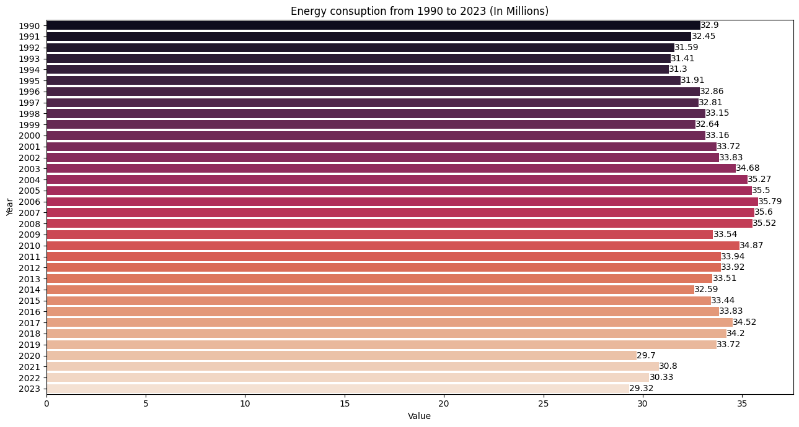
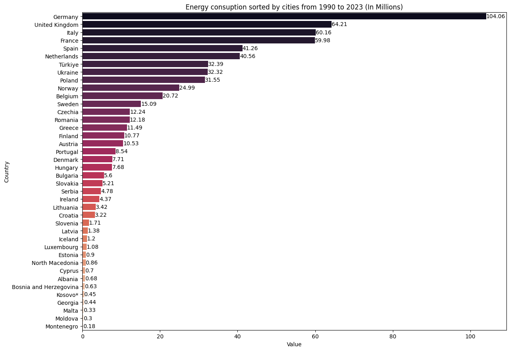
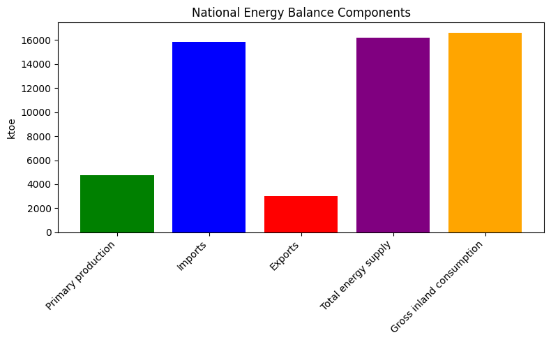
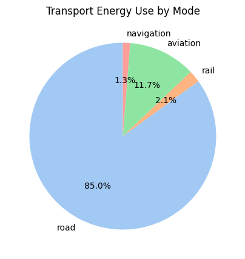
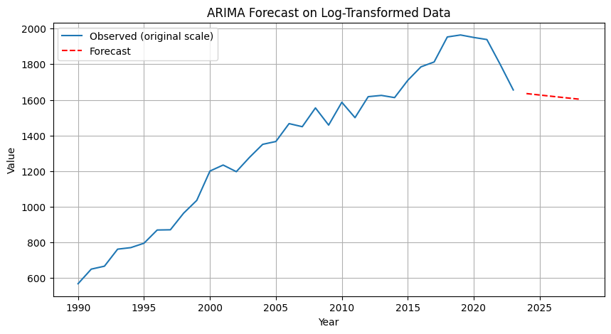

# 📊 Data Analysis Assignment — Ireland Energy Trends (1990–2023)

## 🎯 Project Aim

The objective of this assignment is to perform **Exploratory Data Analysis (EDA)** on Ireland’s energy data from **1990 to 2023**, uncovering insights into consumption patterns, production trends, and renewable energy adoption.

---

## ⚙️ Methodology

* **Data Collection & Cleaning**

  * Imported national energy datasets.
  * Removed inconsistencies and ensured correct data formats.

* **Exploratory Data Analysis (EDA)**

  * Analyzed **consumption vs. production** patterns.
  * Evaluated **sector-wise energy usage** (transport, industry, households).
  * Tracked **renewable energy contributions** over time.

* **Visualization**

  * Line plots to show yearly consumption & production.
  * Bar charts for sector-wise breakdowns.
  * Trend analysis for renewables (wind, solar, hydro).
 
  **plots**
  ## 📊 Key Insights

### Energy-consumption-count (1990–2023)


### Energy Consuptio by cities


### National Energy balance


### Transport-Energy-per-mode.png


### Actual vs Predicted and forecast


---

## 📊 Key Insights

* **Energy Dependency**: Ireland’s **energy demand outpaces domestic production**, leading to reliance on imports.
* **Sectoral Trends**: Transport and households remain the largest energy consumers.
* **Renewables Growth**: Strong upward trend in wind and solar since 2005, but fossil fuels still dominate.
* **Sustainability Gap**: Despite growth in renewables, achieving **EU climate targets** remains a challenge.

---

## 📂 Repository Structure

```
Data_analysis_assignment/
├─ Data_analysis_assignment.html   # Full notebook with outputs
├─ Data_analysis_assignment.ipynb  # (Optional) Jupyter Notebook version
├─ data/                           # Energy datasets
├─ plots/                          # Exported graphs
└─ README.md                       # Project summary
```

---

## 🛠️ Tools & Libraries

* **Language**: Python (Jupyter/Colab)
* **Libraries**:

  * `pandas`, `numpy` → Data wrangling
  * `matplotlib`, `seaborn` → Visualization
  * `scikit-learn` (optional) → Trend analysis

---

## 🔮 Future Work

* Forecast future energy trends using **time series models (ARIMA, LSTM)**.
* Compare Ireland’s energy trends with other EU countries.
* Investigate **policy impacts** on renewable adoption.
